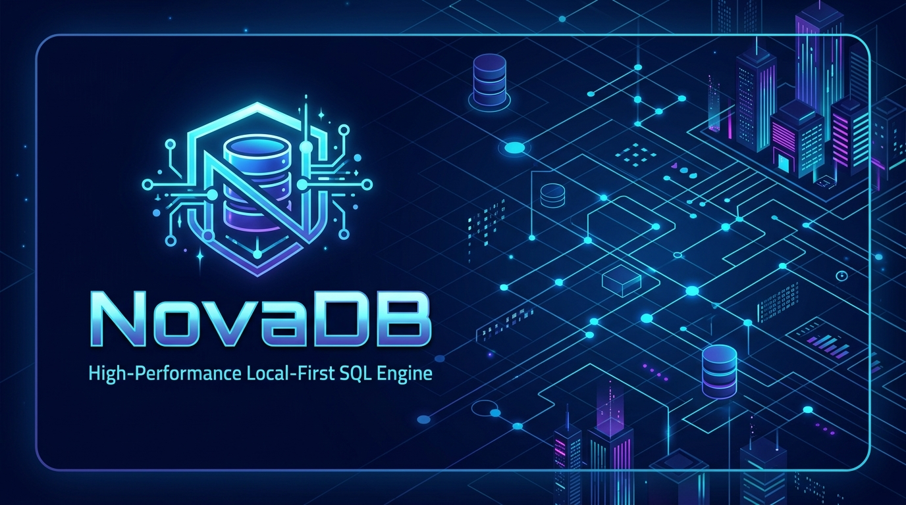

<p align="center">
  
</p>

<p align="center">
  <b>High-Performance, Local-First SQL Database, Sync Engine & PostgreSQL Wire Gateway</b>
</p>

<p align="center">
  <a href="https://github.com/hoangtuvungcao/NovaDB/releases"></a>
  <a href="https://github.com/hoangtuvungcao/NovaDB/actions/workflows/ci.yml"></a>
  <a href="LICENSE"></a>
  <a href="docs/MANUAL.md"></a>
  <a href="https://github.com/hoangtuvungcao/NovaDB"></a>
</p>

NovaDB is a local-first SQLite-powered database platform in Rust with native **PostgreSQL Wire Protocol v3 connectivity (Port 5432)**, a comprehensive **T-SQL compatibility layer**, deterministic **Last-Writer-Wins (LWW) local-first synchronization**, built-in **AI Vector search functions**, 40+ extended SQL functions (JSON RFC 7396, UUID v7, crypto hashes), and an embedded **Web Admin Studio (Port 8787)**.

Official Repository: https://github.com/hoangtuvungcao/NovaDB

---

## Documentation Hub

* [MANUAL.md](docs/MANUAL.md): Complete Database Reference Manual (SQL Dialect, DDL, DML, DQL, Joins, CTEs, Window functions, Vector AI search, T-SQL transpiler, Built-in functions, Rust API).
* [API.md](docs/API.md): API & Network Protocol Specification (PostgreSQL Wire Protocol v3 gateway, Extended Query Protocol, HTTP REST API, Sync Relay protocol).
* [CLIENTS.md](docs/CLIENTS.md): Multi-Language Client Integration Guide (Python, Node.js/TypeScript, PHP, Go, C#, Java, Rust, Ruby, C/C++, cURL).
* [DEPLOYMENT.md](docs/DEPLOYMENT.md): Production Operations & Deployment Guide (Installation, Systemd daemon, Docker Compose, Hot backups, Disaster recovery, Performance tuning).

---

## Key Capabilities

### 1. Dual-Protocol Network Access
* **Port 5432 (PostgreSQL Wire Protocol v3)**: Connect directly with standard SQL tools (`psql`, DBeaver, DataGrip, TablePlus, pgAdmin) and native drivers supporting Simple Query and Extended Query (Parse, Bind, Execute, Sync) protocols.
* **Port 8787 (HTTP REST Admin & Web Studio)**: JSON query execution, batch DDL execution, schema inspection, database backups, integrity verification, and web management console.

### 2. Multi-Client Concurrency (`NovaDbPool`)
* Backed by SQLite WAL mode with non-blocking parallel reads across worker threads.
* 64MB memory page cache, in-memory temporary tables/CTEs (`temp_store = MEMORY`), and 256MB memory-mapped I/O (`mmap_size = 268435456`).

### 3. T-SQL / SQL Server Compatibility Layer
* **Direct Transpilation**: `TOP (N) [PERCENT] [WITH TIES]`, `CROSS APPLY` / `OUTER APPLY`, `GENERATE_SERIES`, `MERGE INTO`, `PIVOT` / `UNPIVOT`, `STRING_SPLIT`, `OPENJSON WITH (...)`, `DATETIME2(7)`, `UNIQUEIDENTIFIER`, `MONEY`.
* **Syntax Tolerance & Migration Ingestion**: Procedural blocks (`CREATE PROCEDURE`, `CREATE FUNCTION`, `CREATE TRIGGER`, `TRY ... CATCH`) are safely parsed and preserved in metadata registry to allow legacy migration scripts to run cleanly.
* **Spatial & Graph Helpers**: `geometry::Point`, `STDistance`, `STContains`, `AS NODE`, `AS EDGE`, `MATCH(A-(E)->B)`.

### 4. Built-in Vector Search & AI Embeddings
* `VECTOR_COSINE_DISTANCE(v1, v2)`, `VECTOR_COSINE_SIMILARITY(v1, v2)`.
* `VECTOR_L2_DISTANCE(v1, v2)`, `VECTOR_DOT_PRODUCT(v1, v2)`.
* `VECTOR_NORM(v)`, `VECTOR_NORMALIZE(v)`, `VECTOR_DIM(v)`.
* `VECTOR_TO_BLOB(json_array)` and `VECTOR_FROM_BLOB(blob)` for compact float32 binary storage.

### 5. Extended SQL Function Library
* **UUIDs**: `UUID_V4()`, `UUID_V7()` (time-ordered monotonic UUIDs), `UUID_IS_VALID()`, `UUID_VERSION()`.
* **Date & Time**: `NOW_ISO()`, `NOW_MS()`, `DATE_PART()`, `DATE_TRUNC()`, `EPOCH_MS()`, `FROM_EPOCH_MS()`, `AGE_MS()`.
* **JSON (RFC 7396)**: `JSON_EXTRACT()`, `JSON_MERGE_PATCH()`, `JSON_PRETTY()`, `JSON_DEPTH()`, `JSON_KEYS()`, `JSON_CONTAINS()`, `JSON_STRIP_NULLS()`.
* **Strings & Hashing**: `REGEXP`, `ILIKE`, `REVERSE()`, `LEFT()`, `RIGHT()`, `SPLIT_PART()`, `LPAD()`, `RPAD()`, `SHA256()`, `MD5()`, `HMAC_SHA256()`, `INITCAP()`.
* **Aggregates**: `STRING_AGG()`, `JSON_AGG()`, `JSON_OBJECT_AGG()`, `ARRAY_AGG()`, `BIT_AND()`, `BOOL_AND()`, `BOOL_OR()`, `EVERY()`.

---

## Role-Based Access Control (RBAC)

NovaDB provides an integrated authentication and role-based access control engine with salted SHA-256 password hashing and table-level grant authorization.

### 1. Built-in Roles and Permissions Matrix

| Role Name | Description | SELECT | INSERT / UPDATE / DELETE | DDL (CREATE/ALTER/DROP) | BACKUP & MAINTENANCE |
|---|---|---|---|---|---|
| `novadb_admin` | Full administrative root access | Allowed | Allowed | Allowed | Allowed |
| `novadb_readwrite` | Read and write application data | Allowed | Allowed | Blocked | Blocked |
| `novadb_readonly` | Read-only analytics & reporting | Allowed | Blocked | Blocked | Blocked |

* **Custom Roles**: You can create custom roles (e.g. `finance_analyst`, `order_manager`) and grant granular table privileges (`SELECT`, `INSERT`, `UPDATE`, `DELETE`, `ALL`) per table.

### 2. RBAC Management SQL Reference

```sql
-- 1. Create a new user with salted password hash
-- User records are stored in _novadb_users
INSERT INTO _novadb_users (username, password_hash, is_active, is_superuser)
VALUES ('app_user', '5e884898da28047151d0e56f8dc6292773603d0d6aabbdd62a11ef721d1542d8', 1, 0);

-- 2. Create a custom role
INSERT INTO _novadb_roles (role_name, description)
VALUES ('finance_analyst', 'Access to billing and reports tables');

-- 3. Assign role to user
INSERT OR IGNORE INTO _novadb_user_roles (username, role_name)
VALUES ('app_user', 'finance_analyst');

-- 4. Grant table-level privileges to role
INSERT OR IGNORE INTO _novadb_grants (role_name, table_name, privilege)
VALUES ('finance_analyst', 'Invoices', 'SELECT'),
       ('finance_analyst', 'Payments', 'SELECT'),
       ('finance_analyst', 'Orders', 'SELECT');

-- 5. Revoke privilege
DELETE FROM _novadb_grants 
WHERE role_name = 'finance_analyst' AND table_name = 'Payments' AND privilege = 'SELECT';

-- 6. Revoke role from user
DELETE FROM _novadb_user_roles 
WHERE username = 'app_user' AND role_name = 'finance_analyst';

-- 7. Deactivate user account
UPDATE _novadb_users SET is_active = 0 WHERE username = 'app_user';
```

---

## Connection Guide & Client Code Examples

### 1. Connecting via CLI and Database Tools

#### PostgreSQL Command Line (`psql`)
```bash
psql -h 127.0.0.1 -p 5432 -U admin -d default
```

#### GUI Database Clients (DBeaver, DataGrip, TablePlus, pgAdmin)
* **Host**: `127.0.0.1` (or server IP)
* **Port**: `5432`
* **Database**: `default` (or database identifier, e.g. `test_db`)
* **Username**: `admin` (or user from `_novadb_users`)
* **Password**: Optional or user password
* **SSL Mode**: `disable` or `prefer`

---

### 2. Multi-Language Code Examples

#### Python (`psycopg2`)
```python
import psycopg2

conn = psycopg2.connect(
    host="127.0.0.1",
    port=5432,
    database="default",
    user="admin",
    password=""
)
cur = conn.cursor()
cur.execute("SELECT uuid_v7() AS id, now_iso() AS ts, 'NovaDB' AS name;")
row = cur.fetchone()
print(f"Connected: ID={row[0]}, Timestamp={row[1]}, Name={row[2]}")
cur.close()
conn.close()
```

#### Node.js / TypeScript (`pg`)
```typescript
import { Client } from 'pg';

const client = new Client({
  host: '127.0.0.1',
  port: 5432,
  database: 'default',
  user: 'admin',
  password: '',
});

async function main() {
  await client.connect();
  const res = await client.query('SELECT uuid_v7() AS id, now_iso() AS ts;');
  console.log('Result:', res.rows[0]);
  await client.end();
}
main();
```

#### PHP (`pdo_pgsql`)
```php
<?php
$dsn = "pgsql:host=127.0.0.1;port=5432;dbname=default;user=admin";
$pdo = new PDO($dsn);

$stmt = $pdo->query("SELECT uuid_v7() AS id, now_iso() AS created_at;");
$row = $stmt->fetch(PDO::FETCH_ASSOC);
echo "ID: " . $row['id'] . " | Created At: " . $row['created_at'] . "\n";
?>
```

#### Go (`pgx` / `database/sql`)
```go
package main

import (
	"database/sql"
	"fmt"
	"log"

	_ "github.com/jackc/pgx/v5/stdlib"
)

func main() {
	db, err := sql.Open("pgx", "postgres://admin@127.0.0.1:5432/default?sslmode=disable")
	if err != nil {
		log.Fatal(err)
	}
	defer db.Close()

	var id, ts string
	err = db.QueryRow("SELECT uuid_v7(), now_iso()").Scan(&id, &ts)
	if err != nil {
		log.Fatal(err)
	}
	fmt.Printf("Connected: ID=%s, Time=%s\n", id, ts)
}
```

#### C# (.NET `Npgsql`)
```csharp
using System;
using Npgsql;

await using var dataSource = NpgsqlDataSource.Create("Host=127.0.0.1;Port=5432;Database=default;Username=admin");
await using var command = dataSource.CreateCommand("SELECT uuid_v7(), now_iso()");
await using var reader = await command.ExecuteReaderAsync();

while (await reader.ReadAsync())
{
    Console.WriteLine($"ID: {reader.GetString(0)}, Time: {reader.GetString(1)}");
}
```

#### Java (JDBC)
```java
import java.sql.Connection;
import java.sql.DriverManager;
import java.sql.ResultSet;
import java.sql.Statement;

public class NovaDbExample {
    public static void main(String[] args) throws Exception {
        String url = "jdbc:postgresql://127.0.0.1:5432/default?sslmode=disable";
        try (Connection conn = DriverManager.getConnection(url, "admin", "")) {
            Statement stmt = conn.createStatement();
            ResultSet rs = stmt.executeQuery("SELECT uuid_v7() AS id, now_iso() AS ts");
            if (rs.next()) {
                System.out.println("ID: " + rs.getString("id") + " | Time: " + rs.getString("ts"));
            }
        }
    }
}
```

#### Rust (`tokio-postgres`)
```rust
use tokio_postgres::NoTls;

#[tokio::main]
async fn main() -> Result<(), Box<dyn std::error::Error>> {
    let (client, connection) = tokio_postgres::connect(
        "host=127.0.0.1 port=5432 dbname=default user=admin",
        NoTls,
    )
    .await?;

    tokio::spawn(async move {
        if let Err(e) = connection.await {
            eprintln!("Connection error: {}", e);
        }
    });

    let rows = client.query("SELECT uuid_v7() AS id, now_iso() AS ts", &[]).await?;
    let id: String = rows[0].get(0);
    let ts: String = rows[0].get(1);
    println!("ID: {}, Timestamp: {}", id, ts);
    Ok(())
}
```

#### HTTP REST API (`cURL`)
```bash
# 1. Execute SQL Query (Returns JSON rows)
curl -X POST http://127.0.0.1:8787/v1/admin/databases/default/query \
  -H "Content-Type: application/json" \
  -d '{"sql": "SELECT uuid_v7() AS id, now_iso() AS created_at;"}'

# 2. Execute Batch DDL Script
curl -X POST http://127.0.0.1:8787/v1/admin/databases/default/execute \
  -H "Content-Type: application/json" \
  -d '{"sql": "CREATE TABLE IF NOT EXISTS Users (Id INT PRIMARY KEY, Name TEXT); INSERT INTO Users VALUES (1, '\''Alice'\'');"}'

# 3. Create Online Hot Backup
curl -X POST http://127.0.0.1:8787/v1/admin/databases/default/backup \
  -H "Content-Type: application/json" \
  -d '{"destination_path": "./novadb-backups/default_backup.novadb"}'

# 4. Check Database Integrity
curl -X POST http://127.0.0.1:8787/v1/admin/databases/default/integrity
```

---

## Quick Start Guide

### 1. Installation Options

#### Option A: One-Line Installer (Recommended for Linux & macOS)
```bash
curl -fsSL https://raw.githubusercontent.com/hoangtuvungcao/NovaDB/master/scripts/install.sh | bash
```

#### Option B: Windows PowerShell One-Line Installer
```powershell
irm https://raw.githubusercontent.com/hoangtuvungcao/NovaDB/master/scripts/install.ps1 | iex
```

#### Option C: Direct Pre-Built Binary Download
Download standalone zero-dependency executables directly from [GitHub Releases](https://github.com/hoangtuvungcao/NovaDB/releases/latest):
* **Linux x86_64**: `novadb-linux-x86_64.tar.gz`
* **Windows x86_64**: `novadb-windows-x86_64.zip` (extract and run `novadb.exe`)
* **macOS (Apple Silicon / Intel)**: `novadb-macos-aarch64.tar.gz` / `novadb-macos-x86_64.tar.gz`

#### Option D: Build from Source (Rust 1.85+)
```bash
git clone https://github.com/hoangtuvungcao/NovaDB.git
cd NovaDB
cargo build --release
```

---

### 2. Launch Server Daemon (HTTP REST 8787 + PostgreSQL Wire 5432)
```bash
novadb serve \
  --listen 127.0.0.1:8787 \
  --pg-listen 127.0.0.1:5432 \
  --data-dir ./novadb-data
```

### 3. Open Web Admin Studio in Browser
Navigate to:
```
http://127.0.0.1:8787/studio
```

### 4. Interactive Terminal Console (REPL)
```bash
# Initialize local database file
novadb init myapp.novadb

# Launch interactive SQL shell with ASCII box tables
novadb console myapp.novadb
```

### 5. Web Admin Studio
Features available in Web Studio (`http://127.0.0.1:8787/studio`):
* **Table Explorer & Grid**: Live spreadsheet data grid with sorting, pagination, WHERE filters, row edit, add column, rename table, truncate, drop, and export.
* **SQL Query Console**: Multi-statement script execution, live execution timer, recent query history, SQL formatting, syntax snippets, and CSV/JSON query export.
* **Schema Designer**: Visual table schema inspection and column definitions.
* **Import & Export Suite**: 1-click `.sql` file script execution, CSV data table import, and full database `.sql` dump export.
* **Vector & AI Search Lab**: Interactive vector similarity testing and embedding inspection.
* **Users & RBAC Security**: User management, active status toggles, and role assignments.
* **Backups & Server Operations**: Hot database backups, database cloning, integrity scans, and WAL checkpoints.

---

## License

NovaDB is open-source software licensed under the Apache-2.0 License.
