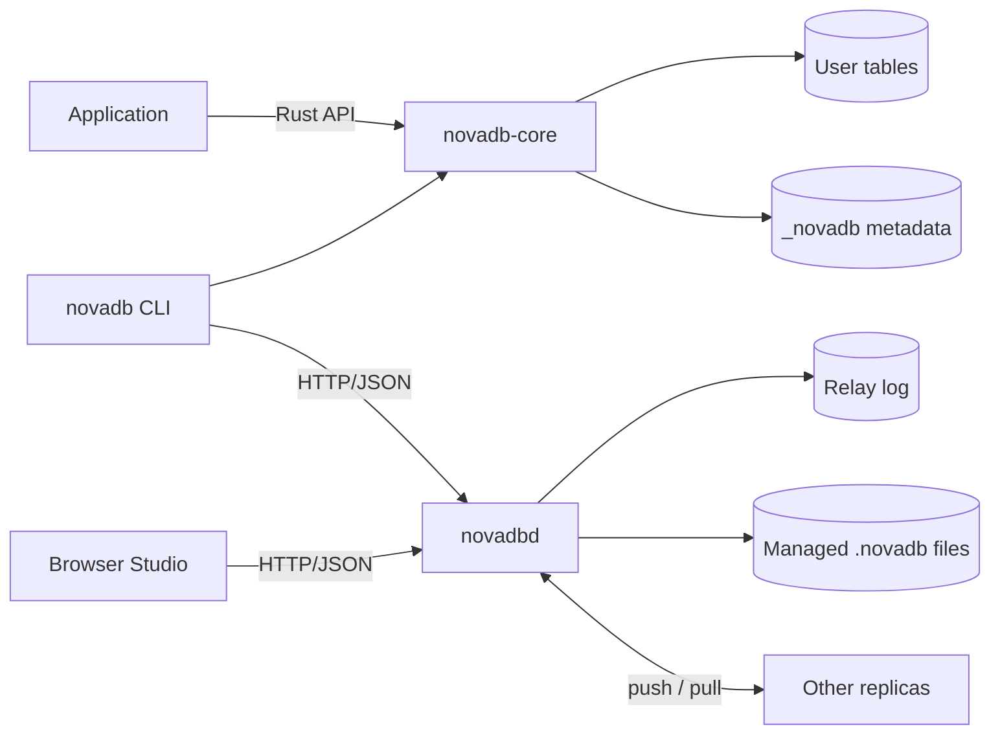
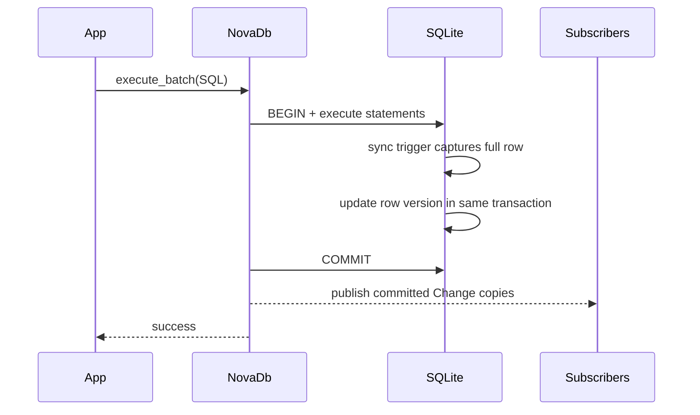
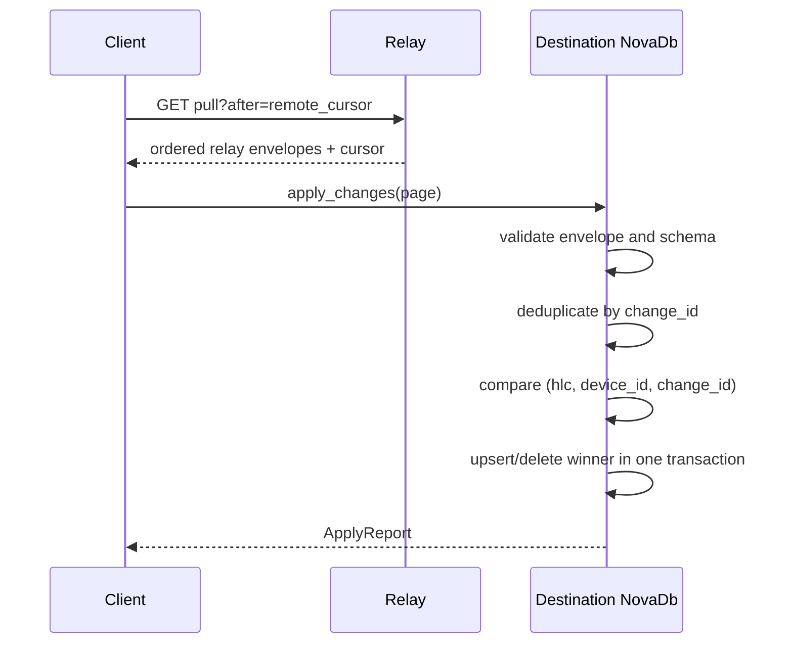

# NovaDB architecture

NovaDB 0.1 deliberately composes a mature local SQL engine with a small replication layer. It
does not contain a new parser, optimizer, B-tree, or distributed transaction engine: SQLite
provides those local facilities, while NovaDB adds identities, full-row changes, deterministic
merge, an append-only relay, managed HTTP databases, and operator tooling.

## System view



In environments where Mermaid is unavailable:

```text
application ── Rust API ──> novadb-core ──> user tables + _novadb_* metadata
      │
      └── novadb CLI ── HTTP/JSON ──> novadbd
                                        ├── relay SQLite log
browser Studio ─────────────────────────└── managed *.novadb databases
                                                    ▲
other replicas ───────────── push / pull ───────────┘
```

The relay log and managed SQL files are separate data planes. Pushing a change stores its
opaque envelope in the relay; it does not execute that mutation in a managed server database.
Likewise, running SQL against a managed database does not automatically make the relay apply
changes to arbitrary clients. A client still owns push/pull orchestration.

## Crates

| Crate | Responsibility |
| --- | --- |
| `novadb-core` | embedded database, metadata bootstrap, triggers, HLC, validation, LWW apply, subscriptions |
| `novadb-server` | durable relay store, managed database catalog, HTTP API, embedded Studio |
| `novadb-cli` | local SQL/sync/lifecycle commands and managed-server HTTP client commands |

`unsafe_code` is forbidden by the workspace lint policy. SQLite is linked using the bundled
`rusqlite` feature for reproducible builds.

## Local write path



1. The app opens the file through `NovaDb` and enables capture for a supported table.
2. On first enable, NovaDB atomically captures existing rows as upserts and installs triggers.
3. `execute_batch` starts one SQLite transaction and rejects nested transaction-control SQL.
4. Triggers use connection-local `novadb_*` scalar functions to append a change and set its row
   version atomically with the user write.
5. Only after commit, the core broadcasts new changes to subscribers.

The MVP logs a complete row image, including for delete operations. This makes schema checking
and replay deterministic but increases storage and network cost for wide rows.

## Remote apply path



Trigger capture is suppressed while applying remote changes, so a pulled envelope does not
become a new local-origin change. The incoming HLC is observed only in staged state; it becomes
the process clock after the transaction commits.

## Internal embedded schema

These tables are implementation details. Do not write to them directly or build stable app
contracts around their current columns.

| Name | Purpose |
| --- | --- |
| `_novadb_meta` | metadata key/value pairs, including schema version and stable device ID |
| `_novadb_changes` | append-only locally originated change log, keyed by local `seq` |
| `_novadb_row_versions` | current winning version/tombstone for each `(table_name, row_id)` |
| `_novadb_applied_changes` | global `change_id` deduplication records for remote apply |
| `_novadb_sync_tables` | registered table, primary key, captured column list, enable time |
| `_novadb_migrations` | immutable migration version, name, SHA-256 checksum, and apply time |
| `_novadb_sync_<table>_*` | generated SQLite triggers, not tables |

The relay uses its own `relay_changes` table with a global autoincrement cursor and uniqueness
on `(database_id, change_id)`.

## Connection and concurrency model

- One `NovaDb` contains one `rusqlite::Connection` guarded by a mutex.
- Clones share that connection and serialize database work.
- SQLite WAL permits concurrent external readers, subject to ordinary SQLite rules.
- A database file should have one `NovaDb` instance per process so its HLC and suppression state
  remain coordinated.
- The server catalog caches at most one `NovaDb` handle per managed database in its process.
- The relay store also serializes access to one SQLite connection and offloads blocking work from
  async request tasks.

This is not a scale-out query architecture. For write-heavy or high-concurrency server
workloads, benchmark against your own requirements.

## Consistency boundaries

| Boundary | Guarantee |
| --- | --- |
| one local `execute_batch` | SQLite atomicity, consistency, isolation, durability according to configured pragmas/filesystem |
| first `enable_sync` | existing-row backfill, trigger installation, and registration commit atomically |
| one remote `apply_changes` slice | atomic and idempotent apply |
| relay push batch | atomic append; duplicate `(database, change_id)` ignored |
| replica convergence | same finite valid change set converges per row under total LWW order |
| schema | local/manual; no schema replication or negotiation |
| multiple tables/replicas | no distributed transaction or global serializable order |

## Trust boundaries

Portable identifiers and database IDs are validated, inbound changes are bounded/validated in
several dimensions, and SQL query versus execution surfaces are separated. The single bearer
token, however, is instance-wide; it is not row-, table-, user-, or database-scoped. The server
enforces documented body/change/SQL limits, while TLS, network policy, tighter rate/concurrency
limits, coordinated backups, and monitoring remain operator responsibilities. See
[Security](security.md).

## Intentional non-goals in 0.1

- replacing SQLite's storage or SQL engine;
- wire-compatible SQLite or SQL Server drivers;
- multi-node query execution or consensus;
- automatic schema replication;
- per-column/CRDT merge;
- server-side scheduling of client sync;
- a full phpMyAdmin-class administration suite.
