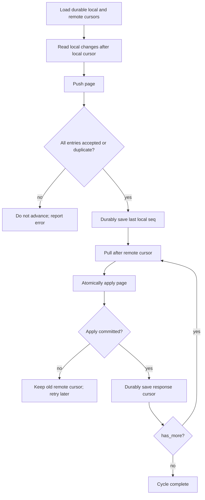

# Sync and convergence model

NovaDB 0.1 provides deterministic eventual convergence per row when every replica eventually
receives the same finite set of valid changes. It does not provide distributed transactions,
causal reads, linearizability, or automatic schema convergence.

## State carried by each replica

- A persistent device UUID in `_novadb_meta`.
- A hybrid logical clock (HLC), restored from the largest known local/row timestamp when opened.
- A local append-only outbound log in `_novadb_changes`.
- One winning version or tombstone per `(table, canonical row ID)` in
  `_novadb_row_versions`.
- IDs of remotely observed changes in `_novadb_applied_changes`.
- Two externally persisted sync continuations: local push sequence and remote pull cursor.

## Total order and last-write-wins

For two changes to the same row, the greater lexicographic tuple wins:

```text
(hlc, device_id, change_id)
```

The HLC is encoded as fixed-width lowercase hexadecimal, so string order matches timestamp order.
Device and change IDs break ties deterministically. An incoming change older than the current
tuple is recorded as observed but does not modify the user row. Deletes participate in the same
order and leave a tombstone in `_novadb_row_versions`, preventing an older upsert from
resurrecting the row.

This ordering is whole-row LWW. Two replicas editing different columns of the same row can lose
one edit when the winning full-row image replaces the other. Per-field merge and CRDT policies
are planned, not implemented.

## Delivery and idempotency

- Push is at-least-once: retrying a batch is safe because the relay enforces uniqueness on
  `(database_id, change_id)`.
- Pull is at-least-once: retrying a page is safe because destinations remember `change_id`.
- `apply_changes` is atomic for its input slice.
- Remote apply suppresses capture triggers and does not add an echoed outbound change.
- A reused older cursor costs extra transfer and duplicate checks but does not change the final
  state.

## Correct client loop



Cursor state should be transactional with your sync job's durable state when possible. The CLI
prints cursors but does not save them.

## Why push cursor is not pull cursor

Suppose replica A has pulled through relay cursor 10. Replica B then pushes cursor 11, and A
pushes its own change as cursor 12. The response to A's push says `cursor: 12`. If A now records
12 as its pull cursor, it skips B's cursor 11 forever. A must continue pulling after 10.

| Stored value | Produced by | Used by |
| --- | --- | --- |
| local push cursor | latest successfully accounted local `seq` | `changes_after` / push `--after` |
| remote pull cursor | latest successfully applied relay page | pull query `after` |
| push response relay cursor | relay snapshot after append | observability only |

## Schema responsibility

Every destination must already have the same supported table shape and matching primary key.
The current safety profile requires exactly one declared writable primary key of exactly
`INTEGER`, or `TEXT` using `BINARY` collation. It rejects a sync table with a composite/generated
primary key or other declared key type,
non-primary-key `UNIQUE` constraint or unique index, inbound/outbound foreign key, or existing
application trigger. Every synchronized `TEXT` value must be valid UTF-8. These restrictions
avoid identity, apply-order, and side-effect ambiguity in the MVP.

The protocol does not send DDL, fingerprints, migrations, defaults, collations, or custom SQL
functions. A mismatched page fails atomically. Roll out compatible migrations to all replicas
before exchanging changes that require the new shape, then refresh sync registration.

## Clock behavior

HLCs preserve local monotonicity and incorporate observed remote timestamps. They are not a
substitute for correct wall-clock operations. Changes more than 24 hours in the receiver's
future are rejected to limit clock-poisoning. Monitor NTP/clock health and quarantine a device
with a badly advanced clock; simply correcting wall time does not erase versions it already won.

## Convergence assumptions

- identical compatible schemas and primary-key interpretation;
- deterministic SQLite constraint/collation behavior relevant to apply;
- delivery of the same complete finite change set;
- no out-of-band writes that bypass capture/version tracking;
- no direct mutation of `_novadb_*` metadata;
- valid HLCs and envelopes.

If any assumption is violated, convergence is not guaranteed.
